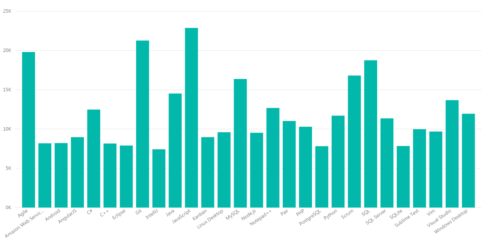
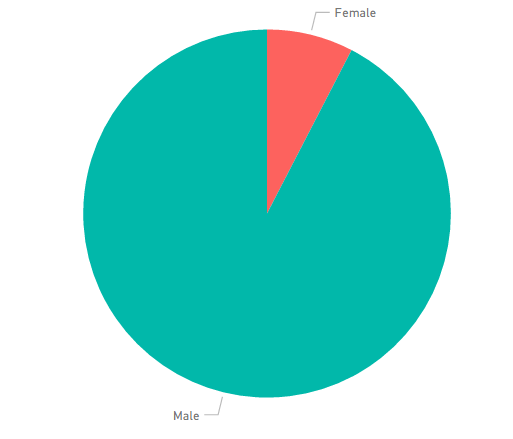
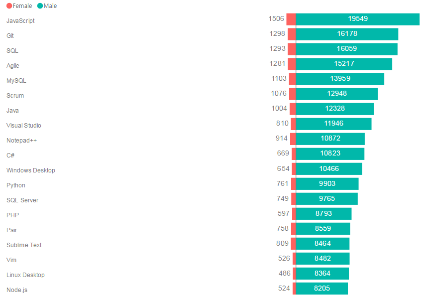

# Differences in the technologies used by male and female developers

## Introduction
As a developer (junior) myself, I always was fascinated by the rate at which the technologies evolved. Over the years the things I learnt when I started my studies in IT are now deprecated and I had to adapt. The other thing that intrigued me was the amount of women studying IT, which is close the none...

I then wondered if there were any differences between the tools and technologies used by men and women (hence my question duh..). I doubt that there is going to be any big differences, but you never know ?

## Methods

To answer my question (questions?) I used the results of [Stackoverflow](https://stackoverflow.com/) annual survey which I found on [Kaggle](https://kaggle.com/).

I roughly went trough the dataset (it's quite large...~60k entries) to see if I could find the information I needed and if it needed to be processed. 

## Results
Before diving into answering of my initial question, I judged/found it important to see what, in general, were the most used technologies. So I made a graph...

And as you can clearly see, the top 3 technologies are JavaScript, Git and Agile.

Then I got curious and wondered what was the proportion of women who answered the survey. 

Not to my surprise the difference is astronomical.

And finally I did a graph to see the differences between men and women.

Apart from the massive difference in numbers, we can see that the differences are minim.

## Conclusion
Before doing an analysis on the data, I already knew I wasn't going to find any differences between the technologies used by women and men. But I wanted to prove myself wrong and still went with that question. 

I do have to admit that due to the huge amount of information given by my dataset I had a lot of other questions that popped in my head (e.g. What is the most used tech by country ? What are students using vs what "professional are, etc..."). But in the end, I stayed with my original question.

I wonder if the results, whatever the question is, can be really trusted. Since the data comes from a survey and only a fraction (?) answered it. And I don't think it really represents what is really used by developers around the world.

As for the tools I used, I had my ups and downs with them. First of all I really enjoyed working with python, I can't really put words to it, but it just felt natural when I used it. 
And then there is Power BI. Over the past few months I've gotten a lot more skeptical with Microsoft products, but I have to admit the things it does, it does it well, but some features I expected to have weren't there, like the option to export my graphs to pdf/image (I did screenshots). If I ever do another analysis I would most likely look into an open source tool to see if I can find something I enjoy more.
